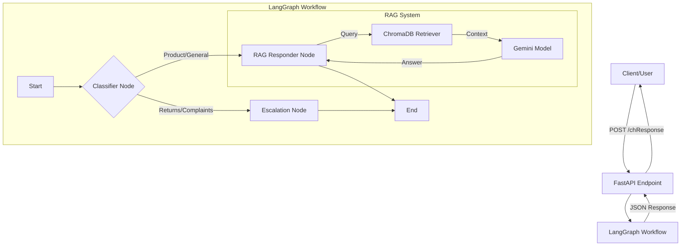

# TechGear Electronics Customer Support Chatbot Design Plan

This document outlines the architecture and implementation design for the TechGear Electronics Customer Support Chatbot. The system will use a RAG (Retrieval Augmented Generation) approach with LangGraph for workflow management and FastAPI for the serving structure.

## Architecture Overview

The system consists of three main layers:
1.  **Data Layer**: Knowledge base ingestion and vector storage (ChromaDB).
2.  **Logic Layer**: LangGraph workflow managing the conversation flow (Classification -> RAG/Escalation).
3.  **Interface Layer**: FastAPI application exposing endpoints for the client.

### System Flow


## detailed Component Design

### 1. Setup & Document Loading (Data Layer)
- **Objective**: Ingest the knowledge base text file into a vector store.
- **Tools**: `LangChain`, `ChromaDB`.
- **Process**:
    1.  **Loader**: Use `TextLoader` to read the raw text file.
    2.  **Splitter**: Use `RecursiveCharacterTextSplitter` to chunk text.
        - *Chunk Size*: ~1000 characters (tunable).
        - *Overlap*: ~200 characters to maintain context.
    3.  **Embeddings**: Use `GoogleGenerativeAIEmbeddings` (or similar supported embedding model).
    4.  **Storage**: Persist vectors in `ChromaDB` (local storage).

### 2. RAG Chain Implementation
- **Objective**: specific chain to retrieve context and answer questions.
- **Model**: Google Gemini (via `ChatGoogleGenerativeAI`).
- **Retriever**: ChromaDB vector store retriever.
- **Prompting**: System prompt to enforce helpful, polite support agent behavior.
- **Flow**:
    - Input: User Query
    - Step 1: Retrieve top $k$ documents (e.g., k=3).
    - Step 2: format prompt with Context + Query.
    - Step 3: Generate response.

### 3. LangGraph Workflow
- **State**: A TypedDict containing `input` (query), `classification` (category), and `output` (response).
- **Nodes**:
    - **Classifier**: 
        - Uses a lightweight LLM call or prompt to categorize the intent into `TECHNICAL_SUPPORT`, `RETURNS`, or `OTHER`.
    - **RAG Responder**:
        - Executed if category is `TECHNICAL_SUPPORT` or `OTHER`.
        - Calls the RAG Chain.
    - **Escalation**:
        - Executed if category is `RETURNS`.
        - Returns a static or templated message: "I'll connect you with a human agent to handle your return."
- **Edges**:
    - Conditional edge from `Classifier` to either `RAG Responder` or `Escalation`.

### 4. FastAPI Endpoint
- **Framework**: `FastAPI`
- **Documentation**: Swagger UI (auto-generated at `/docs`).
- **Endpoints**:
    - `POST /chat`
        - **Request Body**:
            ```json
            {
              "query": "How do I reset my X100 headphones?"
            }
            ```
        - **Response Body**:
            ```json
            {
              "response": "To reset your X100 headphones, press and hold...",
              "category": "TECHNICAL_SUPPORT"
            }
            ```
- **Dependencies**:
    - The LangGraph app will be initialized once on startup to load the vector store and compile the graph.

## Proposed Changes
(For Implementation Phase)

### [Backend Structure]
#### [NEW] [main.py](file:///home/labuser/Chatbot-for-TechGear-Electronics/main.py)
- Entry point for FastAPI.
- Defines the `POST /chat` endpoint.
- Initializes the graph.

#### [NEW] [rag_agent.py](file:///home/labuser/Chatbot-for-TechGear-Electronics/rag_agent.py)
- Contains the LangGraph definition.
- Defines nodes (Classifier, RAG, Escalation).
- Defines the workflow execution logic.

#### [NEW] [ingest.py](file:///home/labuser/Chatbot-for-TechGear-Electronics/ingest.py)
- Script to load the knowledge base and populate ChromaDB.
- Can be run as a standalone script or on startup if DB is empty.

#### [NEW] [requirements.txt](file:///home/labuser/Chatbot-for-TechGear-Electronics/requirements.txt)
- `fastapi`
- `uvicorn`
- `langchain`
- `langchain-google-genai`
- `langgraph`
- `chromadb`
- `pydantic`

## Verification Plan

### Automated Tests
- **Endpoint Test**: Use `pytest` and `TestClient` from FastAPI to send mock requests to `/chat` and verify JSON structure.
- **Workflow Test**: Unit test the individual nodes (Classifier, RAG) with mock inputs to ensure they return expected state updates.

### Manual Verification
1.  **Ingestion**: Run `ingest.py` and verify `chroma_db` folder is created.
2.  **API**: Run `uvicorn main:app --reload`.
    - Open `http://localhost:8000/docs`.
    - Send a "Return" related query -> Verify Escalation response.
    - Send a "Product" related query -> Verify RAG response (mocked or actual if KB provided).
